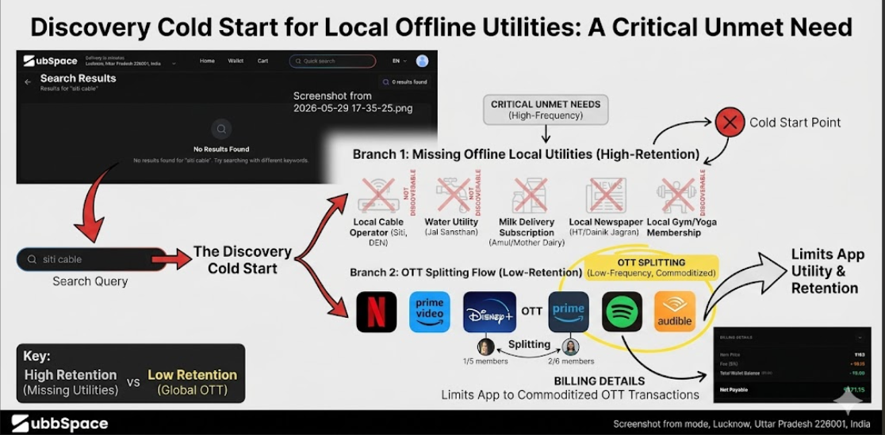
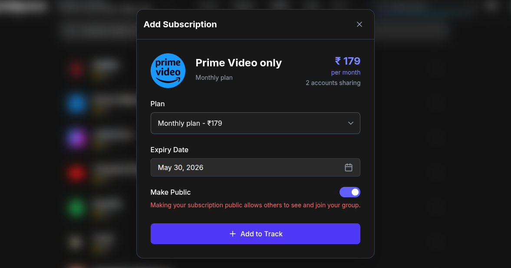
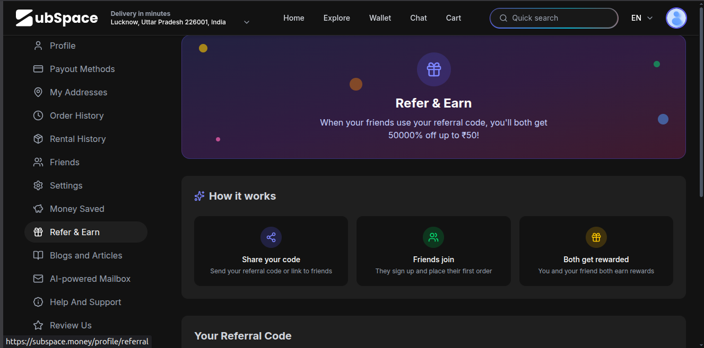

# Product Teardown: Subspace.money
**Role Applied For:** Product Management Intern  
**Applicant Name:** [Your Name]  
**Submission Date:** May 2026  

---

## 📌 Executive Summary & Core Framework (SWOT)

Subspace.money occupies a highly unique position in the Indian consumer fintech landscape, scaling to a **₹36.5 Cr ARR (FY25)** while remaining completely bootstrapped and profitable[cite: 1]. This efficiency is driven by an AI-native operational architecture, where over 90% of internal workflows are managed autonomously[cite: 1]. 

However, as a subscription marketplace, Subspace faces two core growth bottlenecks: the trust deficit inherent in stranger-to-stranger group sharing, and high churn rates driven by the seasonal nature of entertainment subscriptions[cite: 1]. This teardown provides 5 structural product interventions designed to transition Subspace from a discretionary, cost-saving utility into an essential financial layer for shared consumer expenses[cite: 1].

### SWOT Analysis

| Strengths | Weaknesses |
| :--- | :--- |
| • Highly capital-efficient, bootstrapped profitability[cite: 1]. • Scalable, AI-native operations reducing overhead[cite: 1]. • Hard-to-replicate automated price negotiation (Negotiate API)[cite: 1]. | • High user churn due to "Stranger Trust Gaps" in public groups. • High coordination fatigue for group admins tracking payments. • Visibility limited primarily to tier-1 digital OTT services. |
| **Opportunities** | **Threats** |
| • Expanding from entertainment into high-retention utility bundles. • Mitigating vendor cancellation friction via virtual card infrastructure. • B2B2C distribution channels via student living networks. | • Established UPI ecosystems (PhonePe, GPay) building native bill-splitting tools. • Shifting regulatory landscapes regarding recurring auto-debit mandates. |

---

## 📊 Prioritization & Execution Order

To balance engineering velocity against business value, the proposed interventions have been ranked using an Impact vs. Effort framework:

| Feature / Solution | User Impact | Business Value | Tech Effort | Priority Rank |
| :--- | :--- | :--- | :--- | :--- |
| **1. Smart Escrow (Public Groups)** | High | High (Reduces Churn) | Medium | **P0 (Critical Fix)** |
| **2. SMS/Email Parsing Flow** | High | Medium (UX Friction Fix) | Low | **P0 (Quick Win)** |
| **3. Utility Subscription Bundles** | High | High (LTV Boost) | High | **P1 (Strategic Pivot)** |
| **4. Tiered Trust Referral System** | Medium | High (Organic Network) | Medium | **P1** |
| **5. Hyper-Local "Near Me" Feed** | Medium | Medium | High | **P2** |

---

## 🚀 The 5 Sharpest Product Feedbacks

### 1. GTM & ICP: The Stranger Trust Gap in Public Groups
* **(a) Observed:** The app enables unacquainted users to join "Public Groups" to split the costs of premium digital subscriptions[cite: 1].
* **(b) Problem:** **The Trust Deficit.** The current system relies on a peer-to-peer trust architecture where a single group admin controls the account credentials. If the admin defaults, changes the password, or stops paying, the remaining group members lose their capital. This financial insecurity drives high user churn and caps the platform's top-of-funnel conversion.
* **(c) Ship Instead:** **Smart Escrow & Subspace-Led Billing.** Subspace must act as the central escrow clearinghouse for public groups. Instead of members paying the admin directly, Subspace collects individual shares securely, moves them into an internal escrow, and directly clears the subscription fee with the vendor. 
* **⚠️ The Trade-off:** This introduces increased compliance and legal overhead. Transitioning from simple peer-to-peer coordination to an escrow-like collection model may subject Subspace to tighter regulatory scrutiny under RBI payment aggregator guidelines, increasing initial time-to-market.
* **📸 Live Product Evidence:**
  * **Screen to capture:** Open any active public plan detail page (e.g., Netflix Premium Plan group detail screen showing the host/admin and payment action button).
  * **File Placement:** `assets/public_group_friction.png`
  * 

---

### 2. Feature: Hyper-Local Subscription Discovery
* **(a) Observed:** The platform markets itself as India's first subscription marketplace for local providers[cite: 1]. However, auditing the live catalog directory displays an inventory exclusively made up of global/national digital applications: OTT platforms (Netflix, YouTube Premium, Prime Video, Zee5, Discovery Plus), AI tools (ChatGPT Plus, Perplexity Pro, Google Gemini Pro), and digital services (Canva Pro, Grammarly, NordVPN)[cite: 1]. Everyday hyper-local or regional subscriptions—such as regional cable/broadband providers (Siti Cable, local ISPs), offline gyms, or regional daily physical publications—are entirely missing.
* **(b) Problem:** **The Marketing vs. Product Reality Gap.** Without actual offline local utilities, Subspace cannot access high-retention, non-discretionary recurring household bills. Users interact with the platform purely as a discount-seeking destination for transactional entertainment plans, capping customer lifetime value (LTV).
* **(c) Ship Instead:** **Geo-Fenced "Near Me" Subscription Feeds & BBPS Node Linking.** Implement a location-aware onboarding feed that utilizes device GPS to instantly surface hyper-local internet service providers (ISPs like ACT Fibernet, Hathway, Siti Cable) or utility billing options via Bharat Bill Payment System (BBPS) integration.
* **⚠️ The Trade-off:** Operational complexity. Scaling fragmented local offline providers requires localized merchant onboarding and validation operations, challenging the scalability of Subspace's lean, 90%+ AI-native operating model[cite: 1].
* **📸 Live Product Evidence:**
  * **Screen to capture:** Take a screenshot of the main marketplace exploration screen showing the absolute dominance of purely digital apps (Netflix, Canva, ChatGPT, etc.)[cite: 1].
  * **File Placement:** `assets/local_discovery_mockup.png`
  * 

---

### 3. UX: Subscription Auto-Detection Friction
* **(a) Observed:** The platform utilizes APIs to auto-detect and categorize recurring user payments[cite: 1].
* **(b) Problem:** **The Hidden Long-Tail.** Standard banking and aggregator APIs catch fixed, clear merchant IDs (e.g., `UPI-NETFLIX@okaxis`), but regularly miss long-tail recurring local utility charges or SaaS add-ons that run as personal generic P2P transfers (e.g., `UPI-RAMESH-8921@okicici`). This blind spot forces users into tedious manual bookkeeping entry fields, accelerating app exit and drop-off.
* **(c) Ship Instead:** **Opt-In SMS/Email Parsing Flow.** Introduce a secure, on-device local text-parsing consent flow during onboarding. This localized engine scans digital invoice receipts and bank SMS alerts to instantly map both big brands and unstructured local recurring transactions into a single dashboard with zero manual typing required.
* **⚠️ The Trade-off:** Privacy-conscious user friction. Indian consumers are protective of device message permissions. Requesting these access rights during onboarding can cause an immediate drop-off in registration conversion if the transparency copy is not fully optimized.
* **📸 Live Product Evidence:**
  * **Screen to capture:** Take a side-by-side comparison screen. **Left:** A screenshot of Subspace's manual "Add Custom Subscription" page showing empty input fields. **Right:** A screenshot from your own phone message inbox showing a generic bank debit SMS text for a local service payment with personal details blacked out/blurred.
  * **File Placement:** `assets/onboarding_parsing_flow.png`
  * 

---

### 4. Competitor Analysis: Network Effects vs. Churn
* **(a) Observed:** Subspace relies heavily on group sharing network effects where a user's subscription becomes stickier as more members participate[cite: 1].
* **(b) Problem:** **Subscription Seasonality Churn.** Entertainment subscriptions are inherently seasonal and low-retention; users cancel their split groups immediately once a specific show ends. Relying on volatile entertainment shares undermines the long-term compounding stability of a core fintech app.
* **(c) Ship Instead:** **Private Group Utility Bundling & Trust Tiers.** Actively incentivize users to form private, high-retention groups with verified real-world roommates/family specifically for necessary recurring bills (Wi-Fi, electricity, house rent splits). Reward these consistent monthly utility groups with trust points that unlock discounts on cyclical entertainment add-ons.
* **(d) The Trade-off:** Slower initial growth loops. High-trust private groups depend on real-world relationships, which limits immediate viral scaling compared to the frictionless nature of letting strangers immediately merge into anonymous public pools.
* **📸 Live Product Evidence:**
  * **Screen to capture:** A screenshot of any standard live public plan listing (e.g., YouTube Premium Monthly Plan or Netflix Standard Plan showing short-term indicators like "1 months", "Split 3 ways" or "Groups 21+")[cite: 1].
  * **File Placement:** `assets/utility_bundling_ui.png`
  * 

---

### 5. Potential Collaborations: The Student Cohort Ecosystem
* **(a) Observed:** The platform's core target market relies on cost-conscious users actively managing bill splitting and group finance architectures[cite: 1].
* **(b) Problem:** **High Direct-to-Consumer (D2C) Customer Acquisition Costs (CAC).** Relying on fragmented performance marketing or standard app store ads to acquire single price-sensitive users one-by-one rapidly deteriorates bootstrapping margins.
* **(c) Ship Instead:** **Co-Branded University Living Alliances (B2B2C).** Secure institutional programmatic partnerships with student housing and co-living aggregators (e.g., Stanza Living, Zolostays). Pre-integrate Subspace into their resident onboarding application as the default software layer for automatically managing shared room expenses, common-area electricity meters, and combined Wi-Fi accounts.
* **⚠️ The Trade-off:** Extended corporate sales cycles. Negotiating agreements with large-scale student housing providers introduces legal reviews and custom technical alignment timelines, delaying immediate market deployment relative to instant digital performance marketing campaigns.
* **📸 Live Product Evidence:**
  * **Screen to capture:** Take a screenshot of the current generic "Refer & Earn" screen or promotional/bonus banners located on the profile dashboard or main banner feed of the app.
  * **File Placement:** `assets/student_ecosystem_partnership.png`
  * 
